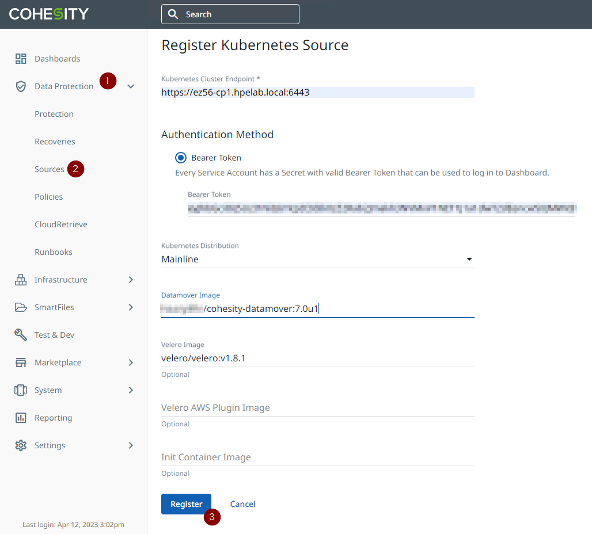

# Cohesity
Hewlett Packard Enterprise and Cohesity offer an integrated approach to solve customer problems commonly found with containerized workloads. HPE Alletra—leveraging the HPE CSI Driver for Kubernetes—together with Cohesity's comprehensive data protection capabilities, empower organizations to overcome challenges associated with containerized environments. 

This guide will demonstrate the steps to integrate Cohesity into a Kubernetes cluster and how to configure a protection policy to back up an application namespace. It proceeds to show that a backup can be restored to a new namespace, useful for providing a test/development environment without affecting the original application namespace.

External Resources:

* Data Protection for Kubernetes using Cohesity with HPE Alletra ([PDF](https://www.hpe.com/psnow/doc/a00133050enw))
* Protect your containerized applications with HPE and Cohesity ([Blog](https://community.hpe.com/t5/around-the-storage-block/protect-your-containerized-applications-with-hpe-and-cohesity/ba-p/7194173))

Cohesity solutions are available through [HPE Complete](https://buy.hpe.com/us/en/storage/complete-storage-solution/complete-storage-solution/complete-partner-program/cohesity/p/1009514534). 

[TOC]

### Solution Overview Diagram

 <br /> <br />

### Environment and Preparations

The HPE CSI Driver has been validated on Cohesity DataProtect v7.0u1. 
Check that the [HPE CSI Driver](https://scod.hpedev.io/csi_driver/index.html#compatibility_and_support) and [Cohesity software](https://docs.cohesity.com/7_0/Web/UserGuide/Content/ReleaseNotes/SupportedVersions.htm#Kubernet) versions are compatible with the Kubernetes version being used.

This environment assumes the HPE CSI Driver for Kuberentes is [deployed](../../csi_driver/deployment.md) in the Kubernetes cluster, an Alletra storage [backend](../../csi_driver/deployment.md#add_an_hpe_storage_backend) has been configured, and a default [`StorageClass`](../../csi_driver/using.md#base_storageclass_parameters) has been defined.

Review Cohesity's "[Plan and Prepare](https://docs.cohesity.com/7_0/Web/UserGuide/Content/Container/plan-prepare.htm)" documentation to accomplish the following:

* Firewall considerations.
* Kubernetes `ServiceAccount` with `cluster-admin` persissions.
* Extract Bearer token ID from above `ServiceAccount`
* Obtain Cohesity Datamover [(download)](https://downloads.cohesity.com/oauth2/login) and push to a local repository or public registry.
!!! note
    Cohesity only supports the backup of user-created application namespaces and does not support the backup of infrastructure namespaces such as `kube-system`, etc.

### Integrate Cohesity into Kubernetes

Review Cohesity's "[Register and Manage Kubernetes Cluster](https://docs.cohesity.com/7_0/Web/UserGuide/Content/Container/register.htm?tocpath=Kubernetes%7C_____2#RegisterKubernetesClusterasaSource)" documentation to integrate Cohesity into your Kubernetes cluster. Below is an example screenshot of the <b>Register Kubernetes Source</b> dialog:<br />
 <br /> 

After the integration wizard is submitted, see the [Post-Registration task documentation](https://docs.cohesity.com/7_0/Web/UserGuide/Content/Container/register.htm?tocpath=Kubernetes%7C_____2#PostRegistrationTask) to verify Velero and datamover pod availability.

!!! note
    The latest versions of Kubernetes, although present in the [Cohesity support matrix](https://docs.cohesity.com/7_0/Web/UserGuide/Content/ReleaseNotes/SupportedVersions.htm#Kubernet), may still require an override from Cohesity support.  

### Configure Namespace-level Application Backup
A Namespace containing a WordPress application will be protected in this example. It contains a variety of Kubernetes resources and objects including:

* Configuration and Storage: `PersistentVolumeClaim`, `ConfigMap`, and `Secret` 
* `Service` and `ServiceAccount`
* Workloads: `Deployment`, `ReplicaSet` and `StatefulSet`

Review the [Protect Kubernetes Namespaces](https://docs.cohesity.com/7_0/Web/UserGuide/Content/Container/protect.htm?tocpath=Kubernetes%7CBackup%7C_____1) documentation from Cohesity. Create a new protection policy or use an available default policy. Additionally, see the [Manage the Kubernetes Backup Configuration](https://docs.cohesity.com/7_0/Web/UserGuide/Content/Container/manage-backup.htm) documentation to add/remove namespaces to a protection group, adjust Auto Protect settings, modify the Protection Policy, and trigger an on-demand run.

See the screenshot below for an example backup <b>Run details</b> view.<br/>


### Demo: Clone a Test/Development Environment by Restoring a Backup
Review the Cohesity documentation for [Recover Kubernetes Cluster](https://docs.cohesity.com/7_0/Web/UserGuide/Content/Container/ContainerRecover.htm?tocpath=Kubernetes%7C_____5#RecoverKubernetesCluster). Cohesity notes, at time of writing, that granular-level recovery of namespaces is not supported. Consider the following when defining a recovery operation:

* Select a protection group or individual namespace. If a protection group is chosen, multiple namespaces could be affected on recovery.
* If any previously backed up objects exist in the destination, a restore operation <i>will not</i> overwrite them. 
* For applications deployed by Helm chart, recovery operations applied to new clusters or namespaces will not be managed with Helm.
* If an alternate Kubernetes cluster is chosen (<b>New Location</b> in the UI), be sure that the cluster has access to the same Kubernetes `StorageClass` as the backup’s source cluster.

!!! note
    Protection groups and individual namespaces appear in the same list. Namespaces are denoted with the Kubernetes ship wheel icon.

For this example, a WordPress namespace backup will be restored to the source Kubernetes cluster but under a new namespace with a "debug-" prefix (see below). This application can run alongside and separately from the parent application.


After the recovery process is complete we can review and compare the associated objects between the two namespaces. In particular, names are similar but discrete volumes, IPs and services exist for each namespace.
```text
$ diff <(kubectl get all,pvc -n wordpress-orig) <(kubectl get all,pvc -n debug-wordpress-orig)
2,3c2,3
< pod/wordpress-577cc47468-mbg2n   1/1     Running   0          171m
< pod/wordpress-mariadb-0          1/1     Running   0          171m
---
> pod/wordpress-577cc47468-mbg2n   1/1     Running   0          57m
> pod/wordpress-mariadb-0          1/1     Running   0          57m
6,7c6,7
< service/wordpress           LoadBalancer   10.98.47.101    <pending>     80:30657/TCP,443:30290/TCP   171m
< service/wordpress-mariadb   ClusterIP      10.104.190.60   <none>        3306/TCP                     171m
---
> service/wordpress           LoadBalancer   10.109.247.83   <pending>     80:31425/TCP,443:31002/TCP   57m
> service/wordpress-mariadb   ClusterIP      10.101.77.139   <none>        3306/TCP                     57m
10c10
< deployment.apps/wordpress   1/1     1            1           171m
---
> deployment.apps/wordpress   1/1     1            1           57m
13c13
< replicaset.apps/wordpress-577cc47468   1         1         1       171m
---
> replicaset.apps/wordpress-577cc47468   1         1         1       57m
16c16
< statefulset.apps/wordpress-mariadb   1/1     171m
---
> statefulset.apps/wordpress-mariadb   1/1     57m
19,20c19,20
< persistentvolumeclaim/data-wordpress-mariadb-0   Bound    pvc-4b3222c3-f71f-427f-847b-d6d0c5e019a4   8Gi        RWO            a9060-std      171m
< persistentvolumeclaim/wordpress                  Bound    pvc-72158104-06ae-4547-9f80-d551abd7cda5   10Gi       RWO            a9060-std      171m
---
> persistentvolumeclaim/data-wordpress-mariadb-0   Bound    pvc-306164a8-3334-48ac-bdee-273ac9a97403   8Gi        RWO            a9060-std      59m
> persistentvolumeclaim/wordpress                  Bound    pvc-17a55296-d0fb-44c2-968b-09c6ffc4abc9   10Gi       RWO            a9060-std      59m
```

!!! note
    Above links are external to [docs.cohesity.com](https://docs.cohesity.com/) and require a [MyCohesity](https://my.cohesity.com/s/login/SelfRegister) account.